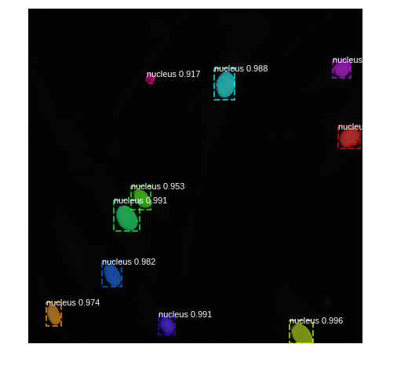
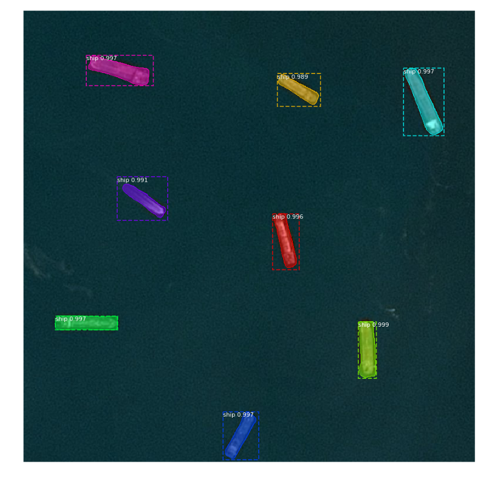

# Kaggle-tutorial
Sample notebooks for Kaggle competitions

## Data Science Bowl 2018

Download the data from [2018 Data Science Bowl](https://www.kaggle.com/c/data-science-bowl-2018/data).

Check out the corresponding medium blog post [Nucleus Segmentation using U-Net](https://medium.com/@abhinav.sagar/nucleus-segmentation-using-u-net-eceb14a9ced4).

## Airbus ship detection challenge

Download the data from [Airbus Ship Detection Challenge](https://www.kaggle.com/c/airbus-ship-detection/data).
