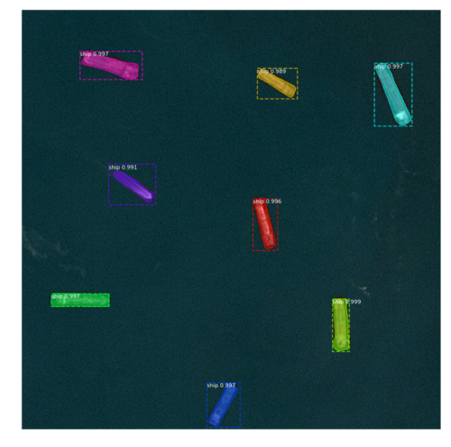
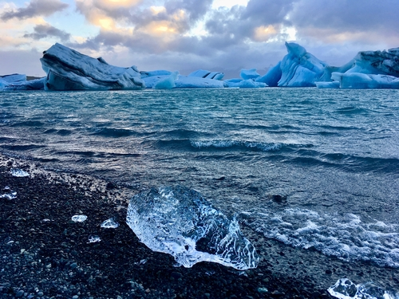
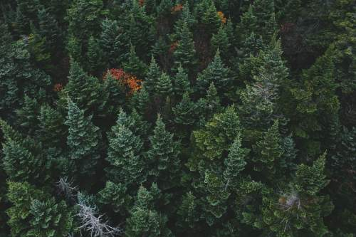

# Kaggle-tutorial
Sample notebooks for Kaggle competitions

## Data Science Bowl 2018

Download the data from [2018 Data Science Bowl](https://www.kaggle.com/c/data-science-bowl-2018/data).

Check out the corresponding medium blog post [Instance Segmentation of Nucleus Images](https://medium.com/@abhinav.sagar/nucleus-segmentation-using-u-net-eceb14a9ced4).

## Airbus ship detection challenge

Download the data from [Airbus Ship Detection Challenge](https://www.kaggle.com/c/airbus-ship-detection/data).

## Statoil/C-CORE Iceberg Classifier Challenge

Download the data from [Statoil/C-CORE Iceberg Classifier Challenge](https://www.kaggle.com/c/statoil-iceberg-classifier-challenge/data).

Check out the corresponding medium blog post [Deep Learning for Iceberg detection in Satellite Images](https://medium.com/@abhinav.sagar/deep-learning-for-iceberg-detection-in-satellite-images-c667acf4bad0).

## Planet: Understanding the Amazon from Space

Download the data from [Planet: Understanding the Amazon from Space](https://www.kaggle.com/c/planet-understanding-the-amazon-from-space/data).
